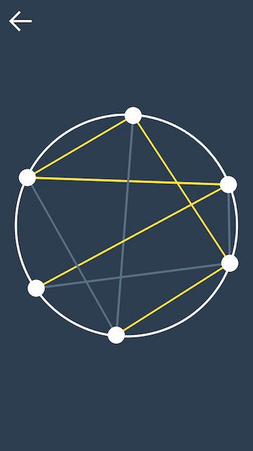

# Connect: Avoid a triangle

There are several points on the circle. The player draws a line connecting any two points avoiding the formation of a triangle from one-color lines. If nothing remains as to construct a triangle, the player is losing.

By the way, the game has an Easter egg. Can you find it?

## How It's Made

It was developed on the Java using framework LibGDX. The framework provides to add shaders and interact with it via code an easy way. In the project I used custom shaders for drawing shapes and SDF text. Shapes are rendering into a texture which then drawn on the screen in the required places as much as necessary. This avoids shader-inside re-drawing graphic elements that do not change. The are used custom animation system for more control. The game saves was done by standard means of LibGDX via Json Serialization.

## Release
LibGDX is a minimalistic framework. The framework allowed to build a lightweight app: android release has size about 3 MB:
 
[Android release](./android/android-release.apk)
